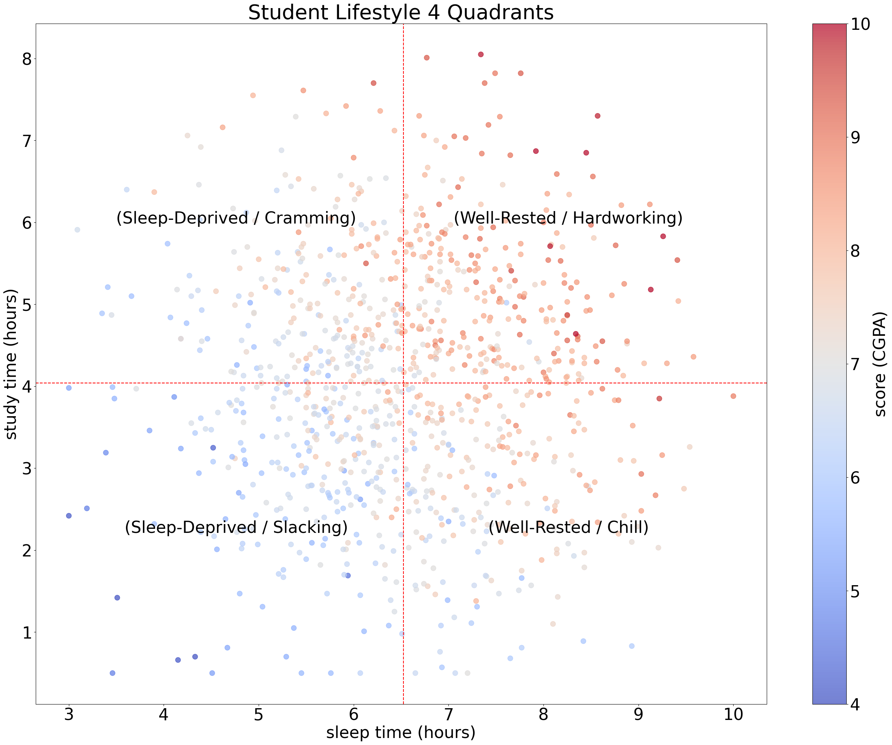
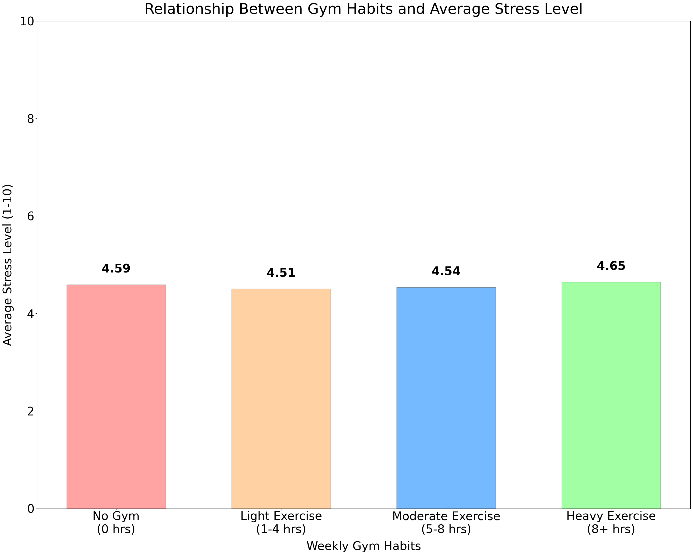

# Student Lifestyle & Academic Performance: Exploratory Data Analysis (EDA)

## Project Overview
This project explores how daily lifestyle choices—specifically sleep, study hours, and physical exercise—impact academic success (CGPA) and student well-being (Stress Levels). Using a dataset of 1,000 student records, this Exploratory Data Analysis (EDA) aims to separate evidence-based success factors from common campus myths.

## Key Objectives
1. **The Sleep-Study Equation:** To determine whether sacrificing sleep for extra study hours (cramming) yields better academic performance.
2. **Exercise and Mental Load:** To analyze if hitting the gym effectively reduces academic-driven stress.

---

## Key Findings & Visualizations

### Theme 1: The Sleep-Study Quadrants (Refuting "Grind Culture")

**Insight:**
Academic success is not strictly linear to study hours. By dividing the student population into four lifestyle quadrants, a clear pattern emerges:
* The highest concentration of top performers (High CGPA) is located in the **"Well-Rested / Hardworking"** quadrant. 
* Conversely, the **"Sleep-Deprived / Cramming"** quadrant—despite showing above-average study hours—is predominantly filled with lower-performing students. 
* **Conclusion:** Sacrificing sleep to extend study time leads to severe inefficiency. A well-rested brain is a prerequisite for translating study hours into actual academic achievements.

### Theme 2: The Gym Myth (Exercise vs. Stress)

**Insight:**
Surprisingly, the data shows that stress remains remarkably stable (around 4.5 out of 10) regardless of the exercise tier. 
* Students engaging in "Heavy Exercise" (8+ hours/week) even show a slight increase in average stress. 
* **Conclusion:** While the gym provides physical benefits, it does not magically solve academic-driven mental load (deadlines, exams). Excessive gym time may instead create "time scarcity," forcing students to rush their studies and thereby maintaining high stress levels.

---

## Methodology & Algorithms
To achieve these objectives, the following comparative visualization algorithms were utilized:

1. **Quadrant Analysis for Sleep-Study Balance:**
   - Calculated the population average for `Sleep_Hours` and `Study_Hours_per_Day`.
   - Generated a scatter plot applying a color gradient mapping (cmap) based on `CGPA` scores.
   - Plotted average baselines to divide the data into four behavioral quadrants for pattern extraction.

2. **Categorical Grouping for Stress Evaluation:**
   - Defined a categorization function to label `Gym_Hours_per_Week` into four discrete lifestyle groups (No Gym to Heavy Exercise).
   - Calculated the mean `Stress_Level_1_to_10` for each category and visualized the variance using a bounded bar chart.

## Repository Structure
* `DSCP_final_project_41147049S.ipynb`: The complete Jupyter Notebook containing the Python code, visualizations, and detailed EDA.
* `DSCP_final_project_41147049S.html`: An exported HTML version of the notebook. This allows anyone to view the complete report, code execution results, and visualizations directly in a web browser without needing to set up a Python environment.
* `gym_and_stress.png`: The generated bar chart visualization illustrating the findings regarding physical exercise and its actual impact on academic mental load.
* `sleep_and_study.png`: The generated scatter plot visualization demonstrating the core insights of the sleep-study observation and the four student archetypes.
* `student_lifestyle_performance_dataset.csv`: The original Kaggle dataset used for this analysis.

## How to Run
To run this analysis locally:
1. Clone this repository.
2. Ensure you have Python installed along with the `pandas` and `matplotlib` libraries.
3. Open `DSCP_final_project_41147049S.ipynb` in Jupyter Notebook or VS Code to run the cells.
